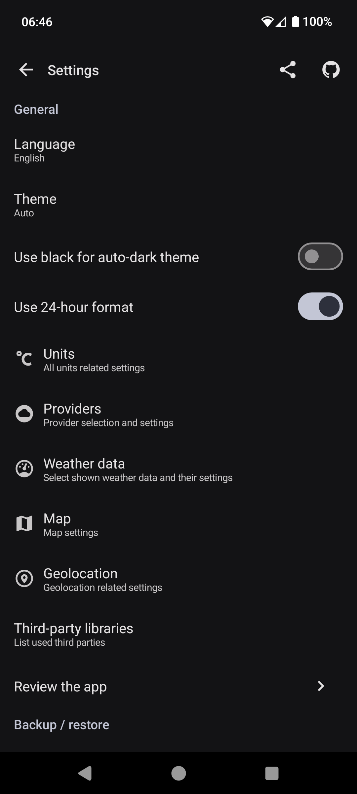
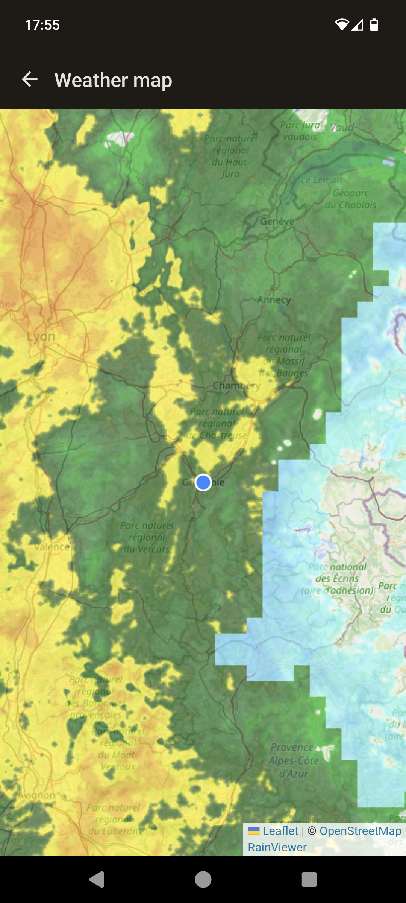

</a>

<h1 align="center">Access weather data from the public OpenWeatherMap data</h1>

  
 

 You can get the <a href="https://github.com/farfromrefug/oss-weather/releases/latest">latest release on GitHub</a>

<h2 align="center">Enjoying oss-weather?</h2>

Please consider making a small donation to help fund the project. Developing an application, especially one that is open source and completely free, takes a lot of time and effort.
 
 

<a href="https://github.com/sponsors/farfromrefug">:heart: Sponsor</a>

Open Source app to access detailed weather data from OpenWeatherMap.
You can create a free OWM key to access weather data.
There is a default key included in the app but the access is limited and you could get errors related to rate limit.

## Screenshots

|  |  |  |

### Having issues, suggestions and feedback?

You can,
- [Create an issue here](https://github.com/farfromrefug/oss-weather/issues)
