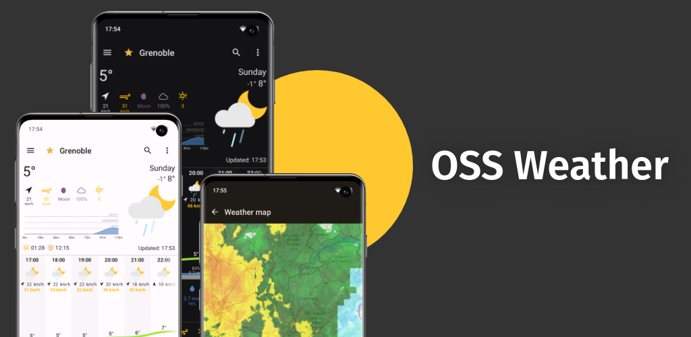
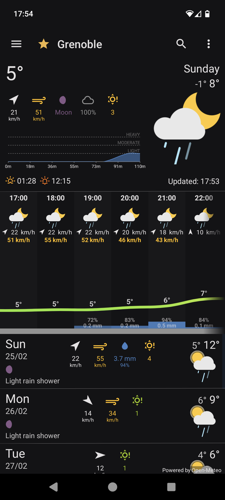
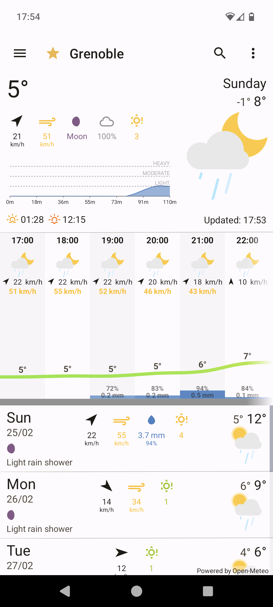
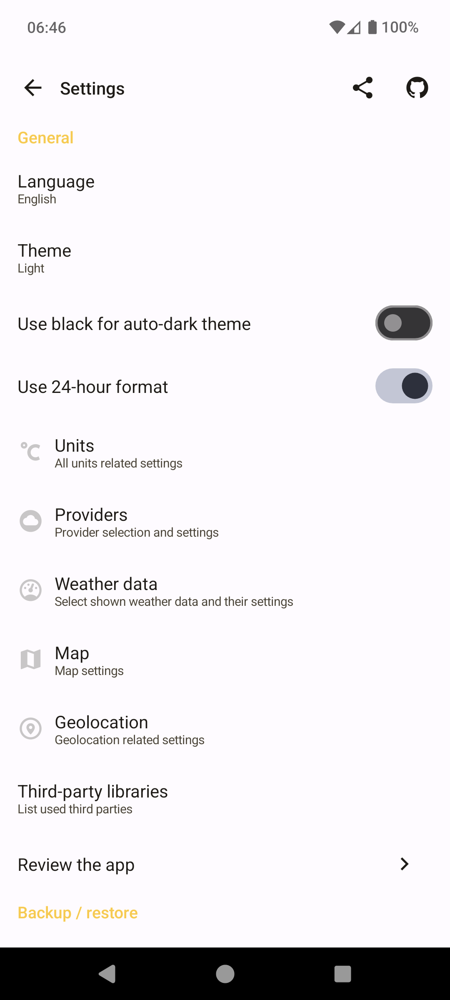
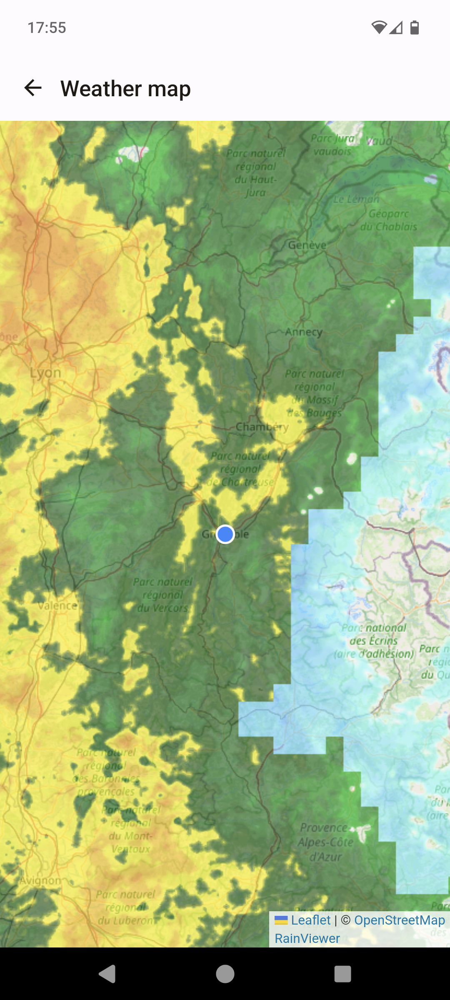

<!-- <h1 align="center">Scan all your documents</h1>

  
  -->

 ## Installation

|  ||
|:-:|:-:|
|||
||

|

 
<!-- 

 You can get the <a href="https://github.com/oss-weather/releases/latest">latest release on GitHub</a>

 

 -->
<h2 align="center">Enjoying OSS Weather?</h2>

Please consider making a small donation to help fund the project. Developing an application, especially one that is open source and completely free, takes a lot of time and effort.
 
 

<a href="https://github.com/sponsors/farfromrefug">:heart: Sponsor</a>

Open Source app to access detailed weather data from OpenWeather, Open-Meteo and Meteo France. Weather radar provided by RainViewer.
You can create a free OWM key to access OpenWeather weather data.
There is a default key included in the app but the access is limited and you could get errors related to rate limits.

## Screenshots

    
    
    

    
    
    

### Having issues, suggestions and feedback?

You can,
- [Create an issue here](https://github.com/farfromrefug/oss-weather/issues)

### Languages: 

The Translations are hosted by [Weblate.org](https://hosted.weblate.org/engage/oss-weather/).

  

Feature Graphic generated with [hotpot.ai](https://hotpot.ai/design/google-play-feature-graphic)

## Building Setup

### Nativescript

First [setup Nativescript](https://docs.nativescript.org/setup/linux)

This project is optimized to be built with [Akylas Fork](https://github.com/Akylas/NativeScript). Though it would work with main it is best to use this fork. The `package.json` defines a resolution to `../NativeScript/dist/packages/core` so clone the fork and build it using `npm run setup:yarn && npm run ui-mobile-base:build && npm run core:build`

### Yarn

You need to use yarn with this project as it uses the `portal:` protocol for some dependencies.
Note that the project has some `yarn link` for easy local dev for me. The best is for you to remove the `resolutions` part of the `package.json`

### Building

Now that all is setup and that you prepared the 3rd party libraries you can actually build and run the app:

* `yarn`
* `ns run android --no-hmr --env.devlog` (replace by `ios` for iOS...)

This should run the app on the first discovered device or emulator.